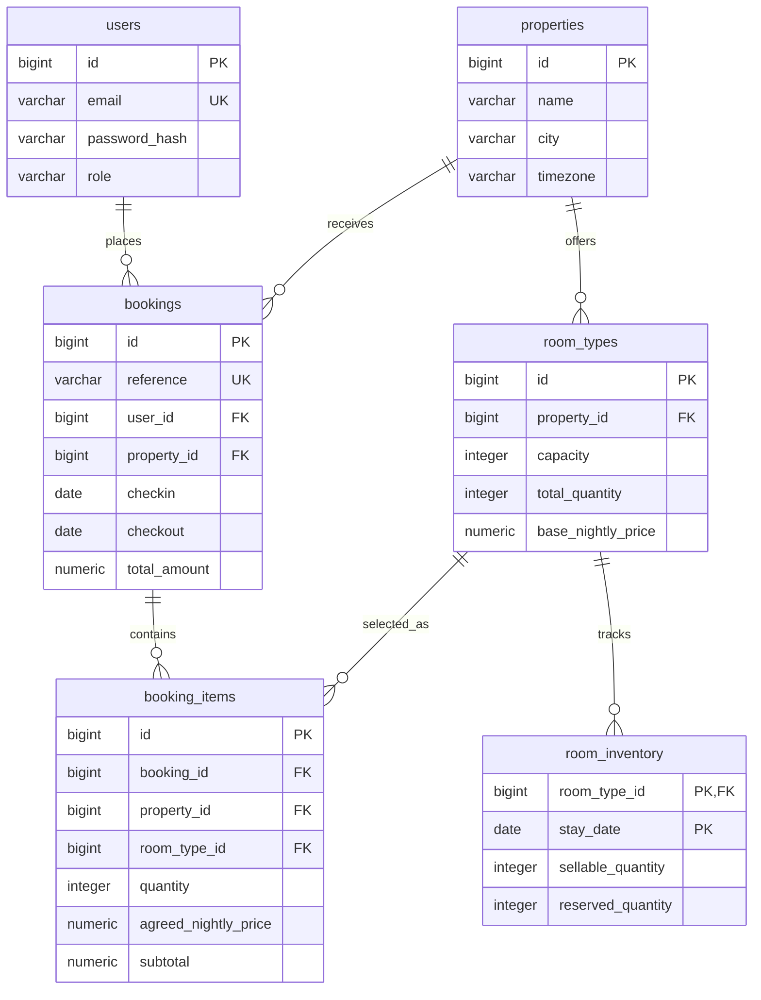

# Hotel Vista database: phase 3

This phase creates the six relational tables. It does not implement Spring APIs, account authentication, nightly booking transactions or deployment. The existing frontend still uses its sample catalogue.

## Relationship diagram

An ER diagram shows records and relationships, not the order of HTTP requests. `||` means one, and `o{` means zero or many. A confirmed booking must have at least one item; the service will enforce that when committing the reservation.

## Read the migration in order

Open `backend/src/main/resources/db/migration/V1__create_hotel_vista_schema.sql`.

| Table | Question it answers | Example |
|---|---|---|
| users | Who is booking? | Pradeep's customer account |
| properties | Which establishment? | Palm & Tide Retreat, Goa |
| room_types | Which category? | Deluxe, 2 guests per room, 10 rooms |
| room_inventory | How many can be sold each night? | 10 October: 10 sellable, 6 reserved |
| bookings | Whose reservation, when, and for how much? | HV-1001, 10-13 October |
| booking_items | Which categories and quantities? | 2 Deluxe rooms at INR 4,000 per night |

1. `GENERATED ALWAYS AS IDENTITY` lets PostgreSQL generate numeric IDs. The public booking reference is a separate unique value supplied by the future service.
2. `NOT NULL` makes a value mandatory. A `CHECK` rejects an invalid value, such as zero room quantity.
3. A primary key identifies a row. A foreign key ensures its parent exists.
4. `NUMERIC(...,2)` stores decimal money rather than floating-point estimates. Explicit checks also reject numeric NaN. This version supports INR only and a constant nightly rate for each item.
5. The inventory primary key has two parts: room type and date. A room type can have many dates but only one record for a given night.
6. `lower(email)` has a unique index, so `Person@example.com` and `person@example.com` cannot become separate accounts. The service must trim and validate email and hash passwords; the database cannot prove a string is a real password hash.

## Why does booking_items repeat property_id?

This is deliberate, controlled redundancy. Its `(booking_id, property_id)` foreign key must match the booking; its `(room_type_id, property_id)` foreign key must match the room category. Together they prevent a booking at Hotel A from containing a room from Hotel B. A pair of unrelated ID foreign keys would not enforce that rule.

## One worked reservation

Two Deluxe rooms at INR 4,000 for 10-13 October cost `2 × 4,000 × 3 = INR 24,000`, assuming no additional charges. The checkout date is excluded. A later catalogue price of INR 5,000 does not change the item's saved INR 4,000 rate.

With nightly availability of 4, 2 and 5 rooms, at most two rooms can be booked for all three nights. Available quantity is calculated as `sellable_quantity - reserved_quantity`; it is not a third stored counter. Missing nightly rows mean unavailable.

## What the schema guarantees and what it does not

| Database now | Transactional service in a later phase |
|---|---|
| Unique account email, booking reference and inventory night | Identify the signed-in customer; enforce ownership and admin rights |
| Checkout after check-in; finite dates | Reject new past check-ins using the property's local date |
| Nonnegative finite money, positive item quantities | Recalculate totals, check item subtotals, save and preserve accepted prices |
| Reserved quantity between zero and sellable quantity | Lock every requested night in a consistent order; require all nights to exist |
| Valid parent records and matching property | Reserve inventory and write booking/items in one transaction |
| Known status values | Enforce allowed state transitions and cancellation exactly once |
| No cascading deletion of reservation history | Deactivate listings; implement retention policy deliberately |

The service also must enforce total guest capacity, sellable inventory no greater than physical quantity, valid timezone names, at least one item, active catalogue records, and totals equal to item sums. Price snapshots are separate columns but not immutable at the SQL-permission level; the future service must not rewrite them after confirmation. Constraints alone do not prove that counters equal actual reservations or prevent a missing inventory update.

Do not put `checkin >= CURRENT_DATE` in a persistent constraint: historical reservations must remain valid as time passes. Use a new-booking validation instead. `DATE` represents stay nights; `TIMESTAMPTZ` represents instants such as the accepted cancellation deadline. Preserve the accepted policy with the booking. The proposed cutoff is midnight starting the check-in date in the property's timezone.

Before real bookings: use row locks and one transaction; lock bookings during cancellation, release each night's rooms once, and implement idempotency for retries. Concurrency, authentication and real booking behavior are not covered by this migration test.

## Official references

- [PostgreSQL constraints](https://www.postgresql.org/docs/current/ddl-constraints.html): primary, unique, check and foreign key constraints, including composite references.
- [PostgreSQL numeric types](https://www.postgresql.org/docs/current/datatype-numeric.html): exact decimal values and special numeric values.

## Explain it in your own words

Start with: “A property has room categories. Each category has a row of inventory per night. One customer reservation has one or more item rows, and each item records the agreed rate.” Then explain why the inventory update and reservation must commit together.
